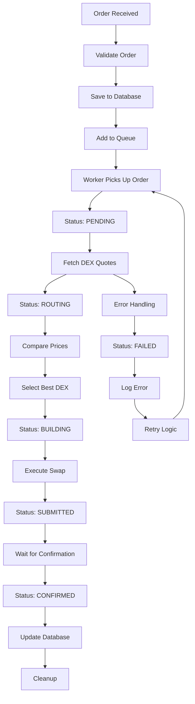

# Order Execution Engine

A high-performance order execution engine with DEX routing, concurrent processing, and real-time status updates. Built with Bun, TypeScript, Fastify, and BullMQ.

## Features

- **Order Types**: Market orders with DEX routing (Raydium & Meteora simulation)
- **Real-time Updates**: WebSocket status streaming for order lifecycle
- **Concurrent Processing**: Queue system managing up to 10 concurrent orders
- **DEX Routing**: Automatic price comparison and best execution venue selection
- **Retry Logic**: Exponential back-off retry (≤3 attempts) with failure handling
- **Database Persistence**: PostgreSQL for historical data, Redis for active orders
- **High Throughput**: Process 100 orders/minute with rate limiting

## Architecture

### Order Execution Flow

1. **Order Submission**: User submits order via POST `/api/orders/execute`
2. **Validation**: API validates order and returns `orderId`
3. **WebSocket Upgrade**: Same HTTP connection upgrades to WebSocket for live updates
4. **DEX Routing**: System fetches quotes from both Raydium and Meteora pools
5. **Price Comparison**: Selects best execution venue based on price/liquidity
6. **Execution**: Routes order to chosen DEX with slippage protection
7. **Status Updates**: Real-time WebSocket updates throughout the process

### 2. Order Processing Pipeline


### 3. Detailed Order Lifecycle

#### **Phase 1: Order Creation**
```typescript
// 1. Client submits order
POST /api/orders/execute
{
  "type": "market",
  "tokenIn": "USDC",
  "tokenOut": "ETH", 
  "amountIn": 1000,
  "userId": "user123"
}

// 2. System validates and creates order
const order = {
  id: "uuid-123",
  type: "market",
  tokenIn: "USDC",
  tokenOut: "ETH",
  amountIn: 1000,
  status: "pending",
  createdAt: "2024-01-01T00:00:00Z"
}
```

#### **Phase 2: Queue Processing**
```typescript
// 3. Order added to BullMQ queue
await queueService.addOrder(orderId, priority = 0)

// 4. Worker processes order concurrently
// Up to 10 orders processed simultaneously
// Rate limited to 100 orders/minute
```

#### **Phase 3: DEX Routing**
```typescript
// 5. Fetch quotes from multiple DEXs
const [raydiumQuote, meteoraQuote] = await Promise.all([
  getRaydiumQuote(tokenIn, tokenOut, amount),
  getMeteoraQuote(tokenIn, tokenOut, amount)
])

// 6. Compare effective prices (after fees)
const raydiumEffective = raydiumQuote.price * (1 - raydiumQuote.fee)
const meteoraEffective = meteoraQuote.price * (1 - meteoraQuote.fee)
const bestQuote = raydiumEffective > meteoraEffective ? raydiumQuote : meteoraQuote
```

#### **Phase 4: Execution**
```typescript
// 7. Execute swap on selected DEX
const result = await dexRouter.executeSwap(bestQuote, order)

// 8. Handle execution result
if (result.success) {
  // Update order with transaction details
  await updateOrderStatus(orderId, 'confirmed', {
    txHash: result.txHash,
    executedPrice: result.executedPrice
  })
} else {
  // Handle failure with retry logic
  throw new Error(result.error)
}
```

## Status Progression

| Status | Description | Duration | Next Action |
|--------|-------------|----------|-------------|
| `pending` | Order received and queued | ~1s | Start processing |
| `routing` | Comparing DEX prices | ~2-3s | Select best DEX |
| `building` | Creating transaction | ~1-2s | Execute swap |
| `submitted` | Transaction sent to network | ~2-4s | Wait for confirmation |
| `confirmed` | Transaction successful | - | Complete |
| `failed` | Execution failed | - | Retry or abort |
